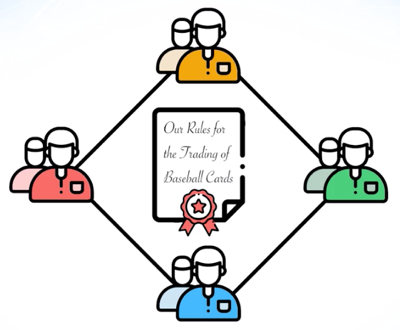

# Blockchain Principle

## Game Theory
### Economic Game Theory
- The study of mathematic models of negotication, conflic and cooperation between parties such individuals businesses, organizations, etc.
- Seek to understand why a person make particular set of dicisions, and how those decision impact other individuals.
- Engage the participant with an activity that will influence their bahavior.

### Marketing Game Theory
- Addresses the icognitive, emotional, and socila aspect of an invidual.
- Includes a system of rules for participants to activate through experimentation or dicovery.
- Usually awards point or badges for levels of participation.
- Often leaderboards that encourage competition or offer prizes.

## Consensus Mechanisms
- A fault-torlerent mechanism that is used in computerand blockchain systems.
- Used to achieve agreement on a single data value or a single state of .the network across distributed actors
- Useful for recordkeeping like a cryptocurrency's transaction history.

## Consitency and Permanence
In both natural and algorithmic systems, consistency must be considered a corenerstone .
### Bitcoin and Performance
- Block rewords in Bitcoin will continue untile the year 2140
- The creator of Bitcoin had the foresight to include an aspect of perfomance.
- Scaling debates can cause fractures in the Bitcoin community.
- Second layer solutions like payment channels will help to maintain Bitcoin's base protocol permanence.

## Trust and Responsibility
- Truth being something that is in accordance with fact of reality.
- Responsibility  being the moral obligation to behave correctly towards or in consideration of all potiontial ramifications by your creation.

### The Basis of Truth
- The immutability of truth is grounded in math.
- How can the qualities of truth have powerful effect in the systems and society in general?
- How does the anscence of truth effect the users and the creators of systems.

### Fators of Responsibility
-Does my system or business have a net negative impact on humanuty?
-If so, it's not likely to be a sustainable system.
- Manay people don't consider this when designing systems.

## Decentralization
Decentralization is the process of distributing and dispersing power away from a central authority. Most financial and governmental systems, which are currently in existence, are centralized, meaning that there is a single highest authority in charge of managing them, such as a central bank or state apparatus.

An exmple of decentralization:
### BitTorrent
- Can't be shut down because there's no main server, just individual computers.
- Computer running BitTorrent connect together to download the files in small pieces.
- You receive parts of the file from many different peers untile the file is completed.

## Scalibility
### Bitcoin Mining
- The difficulty is adjusted evey 2016 blocks, or roughly every two weeks.
- Adjust the difficulty up or down based on the amount of computing power present over the previous two week period.
- Ensures that any major swings in the amount of computational power will not break the network.

## Security
### Bitcoin and Security
- There are billions of dollars of value stored within the Bitcoin network.
- If the security mechanisms in place weren't sound. the network would have failed long ago.
- Third party providers are the ones that have had security conpromised, like wallets, exchanges, personal servers.
### Computational Power
- Ther Bitcoin network currently has roughly four exahashes of power behind it.

        kilahash is 1000 hash
        megahash is 1000000 hash
        gigahash is 1000000000 hash

- Riese in order of kila, mega, tera, peta, exa
### Decentralization and Security
- Try not to base a system on a centralized model with a single point of failaire.
- Checks and balances between system creators and users must be present.
- Systems without these design considerations can have several loopholes and vectors to attack.
- The system should aim to provide freedom from threats and harm.

## User-Friendliness
No matter how complex and robust the system, it should be simple for a user to engage with.
### Compounding Principles
- Consistency ties in with user friendliness in that your system should not be crashing or behaving unpredicibly.
- An inability to be user friendly shows a lack of responsibility and security.
- Strong, sustainable systems compound the principles we've discuss on top of each other.

